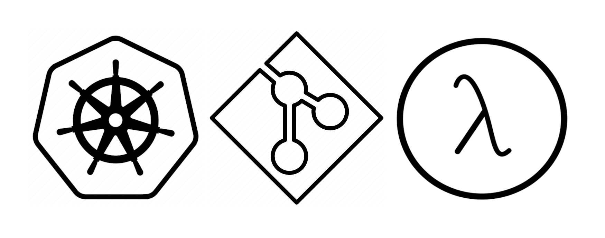

# kube-git-lambda-zsh-theme
Minimal Zsh theme for lovers of lambda calculus.



The prompt shows information about:
- The working directory
- The current Kubernetes context
- The current Kubernetes namespace
- The current Git branch

The **λ** gets green if the last command succeeded; red if it failed.


## Dependencies
- Git
- Kubectx
- Kubens

## Install with [Oh My Zsh](https://github.com/ohmyzsh/ohmyzsh)
Download the theme in the Oh My Zsh `themes` folder.
```bash
mkdir -p ~/.oh-my-zsh/custom/themes/
wget -xqO ~/.oh-my-zsh/custom/themes/kube-git-lambda.zsh-theme https://raw.githubusercontent.com/dapids/kube-git-lambda-zsh-theme/main/kube-git-lambda.zsh-theme
```

Set the theme in the `~/.zshrc` file.
```bash
ZSH_THEME="kube-git-lambda"
```

Source the `~/.zshrc` file.
```bash
source ~/.zshrc
```

Enjoy.
